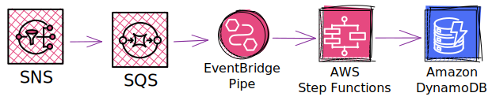

# EventBridge Pipes demo using SNS, SQS StepFunctions and DynamoDB

This is a simple demo of how to use EventBridge Pipes to orchestrate a workflow using SNS, SQS, StepFunctions and DynamoDB.
No Lambda functions are used in the solution.

## Description

The infra in this demo is as follows:



A hypothetical input event to the SNS topic is a JSON object with the following structure:

```json
{
  "city": "Tampere",
  "date": "yyyy-mm-dd",
  "inspectTime": "yyyy-mm-ddThh:mm:ss+hh:mm",
  "tempCelcius": "0.0",
  "humidityPercent": "0.0",
}
```

tempCelcius and humidityPercent are strings due to weird bug in CDK that causes the StepFunction to fail if they are numbers.
See https://github.com/aws/aws-cdk/issues/12456.
In the DynamoDB table these are stored as numbers.

1. A message sent to the SNS topic is forwarded to the SQS queue.
  * At the time of writing, EventBridge Pipes does not support SNS as a source.
2. The EventBridge Pipe polls the SQS queue and starts the StepFunction workflow (express mode).
3. StepFunction workflow stores the event to DynamoDB using StepFunctions Optimized Integration for DynamoDB.

## Deploying

To deploy the infra, run the following commands:

```bash
npx cdk --profile your-profile deploy
```

To send a message to the SNS topic, run the following command:

```bash
aws --profile your-profile sns publish --topic-arn arn:aws:sns:<region>:<account_id>:pipes-test-sns --message '{"city": "Tampere", "date": "2023-10-15", "inspectTime": "2023-10-15T17:00:58+03:00", "tempCelcius": "5.1", "humidityPercent": "58"}'
```

To remove the stack, run the following command:

```bash
npx cdk --profile your-profile destroy
```

Not removing the stack might cause you to incur costs since the EventBridge Pipe polls the SQS queue.
If you exceed the free tier, you will be charged for the SQS requests.
